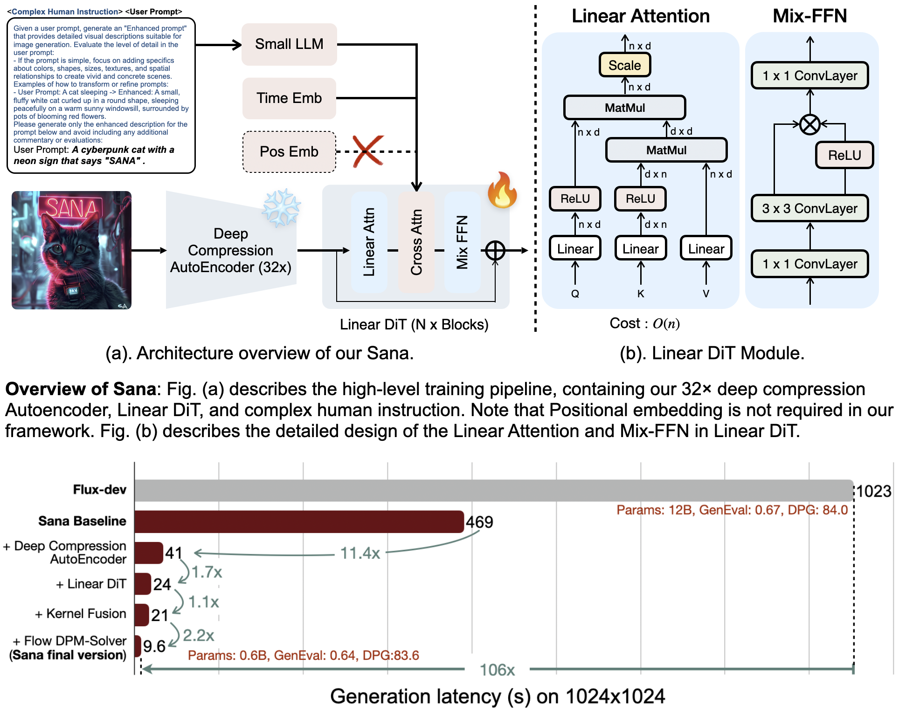

<p align="center" style="border-radius: 10px">
  
</p>

# ⚡️Sana: Efficient High-Resolution Image Synthesis with Linear Diffusion Transformer

<div align="center">
  <a href="https://nvlabs.github.io/Sana/"></a> &ensp;
  <a href="https://hanlab.mit.edu/projects/sana/"></a> &ensp;
  <a href="https://arxiv.org/abs/2410.10629"></a> &ensp;
  <a href="https://nv-sana.mit.edu/"></a> &ensp;
</div>

<p align="center" border-raduis="10px">
  
</p>

## 💡 Introduction

We introduce Sana, a text-to-image framework that can efficiently generate images up to 4096 × 4096 resolution.
Sana can synthesize high-resolution, high-quality images with strong text-image alignment at a remarkably fast speed, deployable on laptop GPU.
Core designs include:

(1) [**DC-AE**](https://hanlab.mit.edu/projects/dc-ae): unlike traditional AEs, which compress images only 8×, we trained an AE that can compress images 32×, effectively reducing the number of latent tokens. \
(2) **Linear DiT**: we replace all vanilla attention in DiT with linear attention, which is more efficient at high resolutions without sacrificing quality. \
(3) **Decoder-only text encoder**: we replaced T5 with modern decoder-only small LLM as the text encoder and designed complex human instruction with in-context learning to enhance the image-text alignment. \
(4) **Efficient training and sampling**: we propose **Flow-DPM-Solver** to reduce sampling steps, with efficient caption labeling and selection to accelerate convergence.

As a result, Sana-0.6B is very competitive with modern giant diffusion model (e.g. Flux-12B), being 20 times smaller and 100+ times faster in measured throughput. Moreover, Sana-0.6B can be deployed on a 16GB laptop GPU, taking less than 1 second to generate a 1024 × 1024 resolution image. Sana enables content creation at low cost.

<p align="center" border-raduis="10px">
  
</p>

## 🔥🔥 News

- Sana code is coming soon
- (🔥 New) \[2024/10\] [Demo](https://nv-sana.mit.edu/) is released.
- (🔥 New) \[2024/10\] [DC-AE Code](https://github.com/mit-han-lab/efficientvit/blob/master/applications/dc_ae/README.md) and [weights](https://huggingface.co/collections/mit-han-lab/dc-ae-670085b9400ad7197bb1009b) are released!
- \[2024/10\] [Paper](https://arxiv.org/abs/2410.10629) is on Arxiv!

## Performance

| Methods                      | Throughput (samples/s) | Latency (s) | Params (B) | Speedup   | FID 👆      | CLIP 👆      | GenEval 👆  | DPG 👆      |
|------------------------------|------------------------|-------------|------------|-----------|-------------|--------------|-------------|-------------|
| _**512 × 512 resolution**_   |                        |             |            |           |             |              |             |             |
| PixArt-α                     | 1.5                    | 1.2         | 0.6        | 1.0×      | 6.14        | 27.55        | 0.48        | 71.6        |
| PixArt-Σ                     | 1.5                    | 1.2         | 0.6        | 1.0×      | _6.34_      | _27.62_      | <u>0.52</u> | _79.5_      |
| **Sana-0.6B**                | 6.7                    | 0.8         | 0.6        | 5.0×      | <u>5.67</u> | <u>27.92</u> | _0.64_      | <u>84.3</u> |
| **Sana-1.6B**                | 3.8                    | 0.6         | 1.6        | 2.5×      | **5.16**    | **28.19**    | **0.66**    | **85.5**    |
| _**1024 × 1024 resolution**_ |                        |             |            |           |             |              |             |             |
| LUMINA-Next                  | 0.12                   | 9.1         | 2.0        | 2.8×      | 7.58        | 26.84        | 0.46        | 74.6        |
| SDXL                         | 0.15                   | 6.5         | 2.6        | 3.5×      | 6.63        | _29.03_      | 0.55        | 74.7        |
| PlayGroundv2.5               | 0.21                   | 5.3         | 2.6        | 4.9×      | _6.09_      | **29.13**    | 0.56        | 75.5        |
| Hunyuan-DiT                  | 0.05                   | 18.2        | 1.5        | 1.2×      | 6.54        | 28.19        | 0.63        | 78.9        |
| PixArt-Σ                     | 0.4                    | 2.7         | 0.6        | 9.3×      | 6.15        | 28.26        | 0.54        | 80.5        |
| DALLE3                       | -                      | -           | -          | -         | -           | -            | _0.67_      | 83.5        |
| SD3-medium                   | 0.28                   | 4.4         | 2.0        | 6.5×      | 11.92       | 27.83        | 0.62        | <u>84.1</u> |
| FLUX-dev                     | 0.04                   | 23.0        | 12.0       | 1.0×      | 10.15       | 27.47        | _0.67_      | _84.0_      |
| FLUX-schnell                 | 0.5                    | 2.1         | 12.0       | 11.6×     | 7.94        | 28.14        | **0.71**    | **84.8**    |
| **Sana-0.6B**                | 1.7                    | 0.9         | 0.6        | **39.5×** | <u>5.81</u> | 28.36        | 0.64        | 83.6        |
| **Sana-1.6B**                | 1.0                    | 1.2         | 1.6        | **23.3×** | **5.76**    | <u>28.67</u> | <u>0.66</u> | **84.8**    |

## Contents

- [TODO](#to-do-list)
- [Citation](#bibtex)

## 💪To-Do List

We will try our best to release

- \[ \] Training code
- \[ \] Inference code
- \[ \] Model zoo
- \[ \] Diffusers
- \[ \] ComfyUI

# 🤗Acknowledgements

- Thanks to [PixArt-α](https://github.com/PixArt-alpha/PixArt-alpha), [PixArt-Σ](https://github.com/PixArt-alpha/PixArt-sigma) and [Efficient-ViT](https://github.com/mit-han-lab/efficientvit) for their wonderful work and codebase!

[//]: # (- Thanks to [Diffusers]&#40;https://github.com/huggingface/diffusers&#41; for their wonderful technical support and awesome collaboration!)
[//]: # (- Thanks to [Hugging Face]&#40;https://github.com/huggingface&#41; for sponsoring the nicely demo!)

# 📖BibTeX

```
@misc{xie2024sana,
      title={Sana: Efficient High-Resolution Image Synthesis with Linear Diffusion Transformer},
      author={Enze Xie and Junsong Chen and Junyu Chen and Han Cai and Haotian Tang and Yujun Lin and Zhekai Zhang and Muyang Li and Ligeng Zhu and Yao Lu and Song Han},
      year={2024},
      eprint={2410.10629},
      archivePrefix={arXiv},
      primaryClass={cs.CV},
      url={https://arxiv.org/abs/2410.10629},
    }
```

[//]: # (## Star History)

[//]: # ([![Star History Chart]&#40;https://api.star-history.com/svg?repos=NVlabs/Sana&type=Date&#41;]&#40;https://star-history.com/#NVlabs/sana&Date&#41;)
